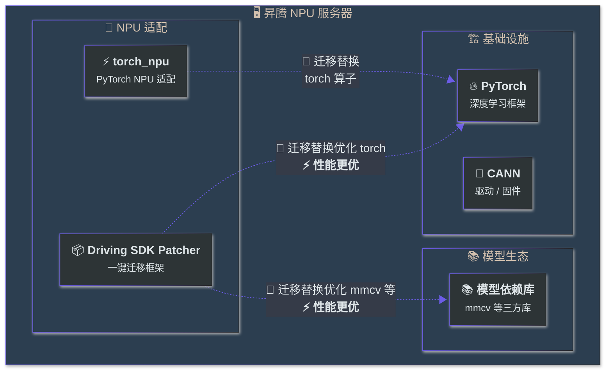
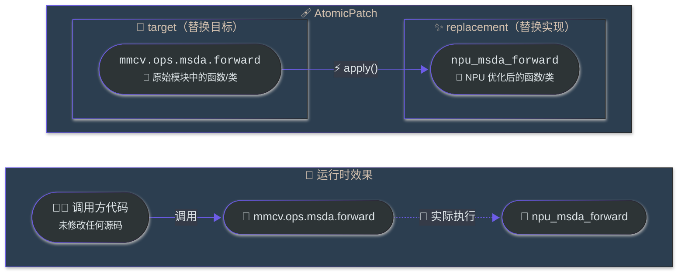

# 一键Patcher 2.0

## 为什么需要一键Patcher

开源自动驾驶模型通常基于 **CUDA 生态**开发。昇腾（Ascend）NPU 的芯片架构与 GPU 存在本质差异——算子实现、内存管理、软件栈调用方式均不相同。这意味着将开源模型迁移到昇腾平台时，开发者需要：

- 替换 CUDA 专属算子为 NPU 实现
- 处理不兼容的第三方库（如 `flash_attn`、`torch_scatter`）
- 调整数据格式与精度策略
- 修改分布式训练逻辑

这些适配工作分散在大量文件中，传统做法是直接修改模型源代码。这会带来几个问题：**代码管理混乱**（原始代码与适配代码混杂）、**升级困难**（上游更新后需重新适配）、**第三方库修改后需重新编译**（如 mmcv 的自定义算子）。

**一键Patcher** 是 Driving SDK 提供的基于 **Monkey Patch**（猴子补丁）的运行时替换框架。Monkey Patch 是一种在程序运行时（Runtime）动态替换模块、类、函数或方法等属性的技术，无需修改原始源代码即可改变程序的行为。一键Patcher 利用这一机制，实现了 **CUDA → NPU 的零侵入迁移**——不修改原始代码的一个字符，通过运行时动态替换即可完成适配。

具体而言，一键Patcher 解决了以下问题：

| 问题 | 解决方式 |
|------|----------|
| 迁移工作量大、门槛高 | 封装常见适配为预定义补丁，一行代码即可应用 |
| 修改三方库源码需重新编译 | 运行时替换，无需修改和编译 mmcv 等库的源代码 |
| 适配代码与原始代码耦合 | 补丁独立于模型代码，**源代码**与**迁移代码**完全解耦 |
| 迁移经验难以复用 | 将已验证的适配方案沉淀为预定义补丁，新模型可直接复用 |
| 缺少昇腾环境的实用功能 | 内置性能采集（Profiling）、训练早停（Brake）等工具 |

> **版本说明**：当前为 Patcher 2.0（推荐），采用声明式 `default_patcher.apply()` API。1.0 的 context-manager 风格 API 仍完全兼容，相关用法见[附录](#附录patcher-10-兼容-api)。

## 快速开始

### 最简用法

在训练脚本（通常是 `train.py`）的**最顶部**（所有其他 import 之前）添加：

```python
# train.py 最顶部
from mx_driving.patcher import default_patcher
default_patcher.apply()

# ↓↓↓ 以下是模型原始代码，一个字符都不需要改 ↓↓↓
import mmcv
import torch
from my_model import build_model
...
```

> **为什么要放在最上方？** Patcher 通过 Monkey Patch 机制替换目标模块的函数/类。如果目标模块在 `apply()` 之前已被导入，补丁可能无法正确生效。
> **关于 torch/torch_npu 依赖**：Patcher 内部会自动处理 torch 和 torch_npu 的导入，用户无需在导入 patcher 之前手动导入这些模块。

### default_patcher 说明

`default_patcher` 是框架预配置的 Patcher 实例，已包含常用的 NPU 优化补丁（针对 mmcv、torch、numpy 等库的补丁，详情参考[预定义补丁列表](#预定义补丁列表)）。

**注意**：`default_patcher` 不保证所有模型的迁移完备性。部分模型可能需要额外添加自定义补丁来处理特定的 CUDA 依赖或算子替换。

### default_patcher + 自定义补丁

当模型有专有的 CUDA 算子需要额外处理时：

```python
from mx_driving.patcher import default_patcher, Patch, AtomicPatch
from mx_driving.patcher.patch import with_imports

class MyCustomPatch(Patch):
    """自定义补丁描述"""

    @classmethod
    def patches(cls, options=None):
        return [
            AtomicPatch(
                "target_module.target_function",
                cls._replacement,
                precheck=cls._precheck,          # 可选：应用前检查
                runtime_check=cls._runtime_check, # 可选：运行时检查
            ),
        ]

    @staticmethod
    def _precheck():
        """应用前检查，返回 False 则跳过此补丁"""
        ...

    @staticmethod
    def _runtime_check(*args, **kwargs):
        """运行时检查，返回 False 则回退到原函数"""
        ...

    @staticmethod
    @with_imports("module")  # 声明函数依赖的外部模块
    def _replacement(...):
        """替换函数实现"""
        ...

default_patcher.add(MyCustomPatch)
default_patcher.apply()
```

说明：

- `Patch.name` 现在是可选的；如果未显式定义，会自动使用类名作为默认标识。
- `disable()` 既支持字符串名，也支持直接传 `Patch` 类或补丁实例，例如 `default_patcher.disable(MyCustomPatch)`。
- 如果你要替换 `default_patcher` 中已启用的某个冲突补丁，推荐先 `disable()` 默认补丁，再 `add()` 你想启用的补丁。

如果你的模型除了默认补丁之外，还需要额外配置导入控制或项目补丁，推荐入口写法是：

```python
from mx_driving.patcher import default_patcher
from migrate_to_ascend.patch import configure_patcher

configure_patcher(default_patcher)
default_patcher.apply()

from tools.train import main
main()
```

### 常用功能速览

```python
from mx_driving.patcher import default_patcher, AtomicPatch

default_patcher.skip_import("<cuda_module>")                     # 跳过 CUDA 模块
default_patcher.replace_import("<old_module>", "<new_module>")   # 整模块替换
default_patcher.inject_import("<src>", "<name>", "<target>")     # 注入导入
default_patcher.add(AtomicPatch("<target>", replacement))        # 添加补丁
default_patcher.with_profiling("<output_dir>")                   # 性能采集
default_patcher.brake_at(<step>)                                 # 训练早停
default_patcher.allow_internal_format()                          # 允许 NPU 内部格式
default_patcher.apply()                                          # 应用所有
```

### 导入控制怎么选

三类导入控制解决的是三个不同问题：

| 场景 | 推荐 API | 典型例子 |
|------|---------|----------|
| 模块在昇腾环境根本不存在，但后续路径并不会真正执行它 | `skip_import()` | `flash_attn`、`torch_scatter` 只是在顶部被 import，真实执行路径会被 NPU patch 接管 |
| 问题就发生在模块 import 边界，需要把整个模块入口换掉 | `replace_import()` | DiffusionDrive 把 `projects.mmdet3d_plugin.ops.deformable_aggregation` 的导出切到 NPU 实现 |
| 类/函数定义在子模块里，但父模块没有正确导出，导致 `from pkg import Name` 失败 | `inject_import()` | DiffusionDrive 把 `V1SparseDrive`、`V1SparseDriveHead` 等类补回 `projects.mmdet3d_plugin.models` |

一个真实的 `configure_patcher()` 片段通常会同时用到三者：

```python
patcher.skip_import("flash_attn", "torch_scatter")
patcher.replace_import(
    "projects.mmdet3d_plugin.ops.deformable_aggregation",
    DeformableAggregationFunction=_DeformableAggregationFunction,
)
patcher.inject_import(
    "projects.mmdet3d_plugin.models.sparsedrive_v1",
    "V1SparseDrive",
    "projects.mmdet3d_plugin.models",
)
```

## 自定义补丁示例：高斯核权重 NPU 优化

下面通过一个完整示例，演示如何将 CUDA 实现替换为 NPU 优化实现。

**Step 1：原始 CUDA 实现**

假设目标模块 `my_model.ops.gaussian` 中有如下函数：

```python
# 文件：my_model/ops/gaussian.py（原始CUDA实现）
import math
import torch

def compute_gaussian_weights(distances, sigma):
    """计算高斯核权重（CUDA版本）"""
    variance = 2.0 * sigma * sigma
    weights = torch.exp(-distances * distances / variance)
    norm_factor = 1.0 / (sigma * math.sqrt(2 * math.pi))
    return weights * norm_factor
```

**Step 2：NPU 优化实现**

在 NPU 上，我们希望使用 `torch_npu` 提供的融合算子来提升性能：

```python
# NPU优化版本
import math
import torch_npu

def compute_gaussian_weights(distances, sigma):
    """计算高斯核权重（NPU优化版本）"""
    variance = 2.0 * sigma * sigma
    weights = torch_npu.npu_exp(-distances * distances / variance)  # 使用NPU融合算子
    norm_factor = 1.0 / (sigma * math.sqrt(2 * math.pi))
    return weights * norm_factor
```

**Step 3：编写 Patch 实现替换**

```python
from mx_driving.patcher import default_patcher, Patch, AtomicPatch
from mx_driving.patcher.patch import with_imports
import torch

class GaussianWeightsPatch(Patch):
    """高斯核权重计算NPU优化"""
    name = "gaussian_weights"

    @classmethod
    def patches(cls, options=None):
        return [
            AtomicPatch(
                "my_model.ops.gaussian.compute_gaussian_weights",
                cls._compute_gaussian_weights_npu,
                runtime_check=cls._check_fp32,  # 仅FP32输入时使用NPU优化
            ),
        ]

    @staticmethod
    def _check_fp32(distances, sigma):
        """运行时检查：仅FP32输入使用NPU优化，其他dtype回退原实现"""
        return distances.dtype == torch.float32

    @staticmethod
    @with_imports("math", "torch_npu")  # 声明函数依赖的外部模块
    def _compute_gaussian_weights_npu(distances, sigma):
        """NPU优化实现"""
        variance = 2.0 * sigma * sigma
        weights = torch_npu.npu_exp(-distances * distances / variance)  # noqa: F821
        norm_factor = 1.0 / (sigma * math.sqrt(2 * math.pi))  # noqa: F821
        return weights * norm_factor

default_patcher.add(GaussianWeightsPatch)
default_patcher.apply()
```

**关键点说明：**

| 特性 | 作用 |
|------|------|
| `with_imports` | 声明函数依赖的外部模块 |
| `runtime_check` | 运行时检查输入 dtype，仅 FP32 时使用 NPU 优化，FP16/BF16 自动回退原实现 |
| `AtomicPatch` | 指定替换目标路径和替换函数 |

## 执行流程

### 整体环境

一键Patcher 在以下环境链中工作：



### apply() 背后发生了什么？

```mermaid
---
config:
  look: neo
  theme: base
  themeVariables:
    primaryColor: "#2d3436"
    primaryTextColor: "#dfe6e9"
    primaryBorderColor: "#6c5ce7"
    secondaryColor: "#353b48"
    tertiaryColor: "#2c3e50"
    lineColor: "#6c5ce7"
    fontFamily: "Segoe UI, Microsoft YaHei, sans-serif"
---
flowchart TD
    A(["🚀 <b>default_patcher.apply&#40;&#41;</b>"])
    A --> B1(["📥 ① 导入控制"])
    A --> B2(["🩹 ② 补丁替换"])
    A --> B3(["⚙️ ③ 环境配置"])

    subgraph S1 ["📥 导入控制"]
        B1 --> C1(["🚫 skip_import<br/><small>拦截 CUDA 模块的 import</small>"])
        B1 --> C2(["🔄 replace_import<br/><small>替换模块为 NPU 实现</small>"])
    end

    subgraph S2 ["🩹 补丁替换"]
        B2 --> D1(["🔍 遍历所有补丁<br/><small>预定义 + 自定义</small>"])
        D1 --> D2(["⚡ AtomicPatch<br/><small>target → replacement</small>"])
    end

    subgraph S3 ["⚙️ 环境配置"]
        B3 --> E1(["🎛️ NPU 设置<br/><small>内部格式 / profiling</small>"])
    end

    C1 & C2 & D2 & E1 --> F(["🔗 被替换过的函数/类<br/>已经是 NPU 版本"])
    F --> G(["✅ <b>模型在昇腾 NPU 上运行</b><br/>原始代码零修改"])
```



**关键要点**：`apply()` 必须在所有其他 `import` 之前调用。因为 Patcher 通过替换模块属性实现补丁——如果目标模块已经被导入并且其属性已被其他模块引用，补丁将无法生效。

---

## 核心概念：Atomic Patch

一键Patcher 的最小工作单元是 **AtomicPatch**（原子补丁），它执行一次精确的运行时替换：



- **target**：被替换的原始属性路径（如 `"mmcv.ops.msda.forward"`）
- **replacement**：替换后的新实现（NPU 优化版本）

模型原始代码中调用 `mmcv.ops.msda.forward()` 的地方，在 `apply()` 之后实际执行的是 NPU 版本，而代码文本没有任何变化。

### Patch 与 Patcher

| 概念 | 说明 |
|------|------|
| **AtomicPatch** | 最小补丁单元，执行单个 target → replacement 替换 |
| **Patch** | 组合补丁，将多个相关的 AtomicPatch 组织在一起（如一个算子的 forward + backward） |
| **Patcher** | 补丁管理器，收集、组织和应用所有补丁，并提供导入控制等辅助功能 |
| **default_patcher** | 预配置的 Patcher 实例，已包含常用预定义补丁，开箱即用 |

## 预定义补丁列表

框架内置了经过验证的 NPU 适配补丁，新模型可直接复用：

| 模块 | 补丁名称 | 说明 | default_patcher |
|------|----------|------|:---------------:|
| **mmcv** | MultiScaleDeformableAttention | 多尺度可变形注意力 | ✅ |
| | DeformConv | 可变形卷积 | ✅ |
| | ModulatedDeformConv | 调制可变形卷积 | ✅ |
| | SparseConv3D | 3D稀疏卷积 | ✅ |
| | Stream | CUDA 流管理 | ✅ |
| | DDP | 分布式数据并行 | ✅ |
| | Voxelization | 体素化 | ❌ |
| | OptimizerHooks | 优化器钩子（mmcv 1.x） | ❌ |
| **mmengine** | OptimizerWrapper | 优化器包装器 | ❌ |
| **mmdet** | PseudoSampler | 伪采样器 | ❌ |
| | ResNetAddRelu | ResNet 加 ReLU 融合 | ✅ |
| | ResNetMaxPool | ResNet 最大池化 | ✅ |
| | ResNetFP16 | ResNet FP16 支持 | ❌ |
| **mmdet3d** | NuScenesDataset | NuScenes 数据集 | ✅ |
| | NuScenesMetric | NuScenes 评估指标 | ✅ |
| **numpy** | NumpyCompat | NumPy 兼容性修复 | ✅ |
| **torch** | TensorIndex | 张量索引优化 | ✅ |
| | BatchMatmul | 批量矩阵乘法 | ✅ |
| **torch_scatter** | TorchScatter | scatter 操作 NPU 实现 | ❌ |

> ✅ = 已包含在 `default_patcher` 中，`apply()` 即生效。❌ = 需通过 `patcher.add()` 手动添加。
> `NumpyCompat` 属于默认补丁中的早期兼容补丁，用于恢复 `np.bool` / `np.float` / `np.int` 等已移除别名，避免第三方库在 import-time 就因 NumPy 兼容性问题提前失败。

## 迁移代码的文件组织

推荐将所有迁移相关代码集中在独立的 `migrate_to_ascend/` 文件夹中，实现**源代码**（模型原始代码）与**迁移代码**（NPU 适配代码）的物理解耦：

```shell
my_model/                          ← 源代码（Source Code）
├── configs/                         不做任何修改
├── projects/
│   ├── models/
│   └── ops/
├── tools/
│   ├── train.py                     原始训练脚本
│   └── test.py
│
├── migrate_to_ascend/             ← 迁移代码（Migration Code）
│   ├── patch.py                     补丁定义和 patcher 配置
│   ├── train.py                     昇腾训练入口（基于原始 train.py，顶部加入 patcher 代码）
│   ├── test.py                      昇腾测试入口（基于原始 test.py，顶部加入 patcher 代码）
│   ├── train_8p.sh                  8卡分布式训练脚本
│   └── requirements.txt             昇腾环境依赖
│
├── README.md
└── setup.py
```

**这种组织方式的优势**：

- **零侵入**：`my_model/` 下的所有文件不做任何修改
- **一键迁移**：将 `migrate_to_ascend/` 文件夹拷入开源模型仓即可运行
- **双栈共存**：同一个仓库、同一个分支可以同时支持 CUDA 和昇腾两种环境
- **独立管理**：迁移代码的版本控制与模型原始代码互不干扰

**训练入口示例**（`migrate_to_ascend/train.py`）：

```python
from mx_driving.patcher import default_patcher
from migrate_to_ascend.patch import configure_patcher

configure_patcher(default_patcher)
default_patcher.apply()

from tools.train import main
main()
```

实际项目参考：[DiffusionDrive](../../../model_examples/DiffusionDrive/README.md) 和 [PanoOcc](../../../model_examples/PanoOcc/README.md) 的 `migrate_to_ascend/` 目录。

## Utility 功能

### 采集性能 Profiling

```python
default_patcher.with_profiling("path/to/profiling/", level=1)

# 精确控制 profiling 采集的 step 参数
default_patcher.with_profiling("path/to/profiling/", level=1,
                                skip_first=100,
                                wait=1,
                                warmup=5,
                                active=10,
                                repeat=2)
default_patcher.apply()
```

默认 step 控制参数：skip_first=20, wait=1, warmup=1, active=1, repeat=1。

- `level`：0=只记录 NPU；1=NPU+CPU；2=NPU+CPU+调用栈
- `skip_first`：跳过前 N 次迭代（排除初始化开销）
- `wait`：等待系统稳定后再开始记录
- `warmup`：预热阶段（执行但不记录）
- `active`：实际记录数据的迭代次数
- `repeat`：整体过程重复次数（0 表示不重复）
- 总迭代次数 = skip_first + (wait + warmup + active) × (repeat + 1)

### 训练早停 Early Brake

```python
default_patcher.brake_at(1000)  # 第 1000 步自动停止
default_patcher.apply()
```

### Profiling 与 Brake 组合

同时使用 Profiling 和 Brake 可实现"采集完 profiling 后自动停止"：

```python
default_patcher.with_profiling("/path/to/prof", level=1).brake_at(500).apply()
```

## 版本指南

**最佳实践**：新项目请优先使用 Patcher 2.0 的声明式 `apply()` API，配合 `migrate_to_ascend/` 目录组织迁移代码（详见[迁移代码的文件组织](#迁移代码的文件组织)），实现源代码与迁移代码的彻底解耦。迁移范例可参考：

- [DiffusionDrive](../../../model_examples/DiffusionDrive/README.md)
- [PanoOcc](../../../model_examples/PanoOcc/README.md)

**迁移计划**：仓库中现有的 1.0 风格模型示例（`with patcher:` 上下文管理器）将逐步迁移至 2.0 写法。1.0 API 继续保留兼容，但新开发的补丁和迁移代码请统一使用 2.0。

> 更多信息：导入控制、补丁机制、运行时检查、日志配置等功能的详细 API 说明，请参阅 [一键Patcher 功能详解](./patcher_features.md)。

## 附录：Patcher 1.0 兼容 API

以下为 Patcher 1.0 的 context-manager 风格用法，1.0 API 在当前版本仍完全兼容，已有项目可继续使用。该特性主要包含以下内容：

### 主要功能

1. Patcher框架: 提供对补丁的封装、管理、应用、构建、异常处理等机制
2. 预定义Patch: 总结归纳了高泛用性的Patch实现，主要针对mmcv、torch、numpy等包，并封装好对应的预定义补丁供用户快速迁移优化模型
3. 默认Patcher：提供了提升易用性的`default_patcher_builder`的预定义类实例，帮助用户**仅通过添加几行代码**即可快速迁移模型到昇腾NPU上运行
4. 自定义Patch：用户可通过一键patcher的接口实现针对某个模型专用的自定义补丁，并结合通用公共补丁以兼容各式各类的模型迁移
5. Utility功能：通过补丁机制提供一些易用性提升的功能，例如训练early brake和采集profiling等实用功能

### 当前已支持特性

- [x] 支持default patcher快速迁移
- [x] 支持自定义patcher
- [x] 支持黑名单机制禁用特定patch
- [x] 支持应用具体Patch失败时的日志告警与异常处理
- [x] 支持一键迁移torch至torch_npu（默认关闭私有格式）
- [x] 支持通用CV算子的NPU亲和实现：
  - [x] MultiScaleDeformableAttention（msda）
  - [x] DeformableConv2d （dcn）
  - [x] ModulatedDeformConv2d （mdc）
  - [x] ResNet优化：
    - [x] npu_add_relu
    - [x] npu_max_pool
    - [x] 支持FP16数据格式
- [x] 支持替换index_bool索引操作为masked_select
- [x] 支持Nuscenes数据集操作的NPU亲和优化
  - [x] output_to_nusc_box四元数旋转优化
- [x] 支持优化器的NPU亲和优化
  - [x] 梯度累积优化
  - [x] FP16训练的适配
  - [x] 支持clip_grad_norm_fused_
- [x] 支持mmdet.pseudo_sampler去除unique操作的优化
- [x] 支持兼容性适配
  - [x] 提供patch_mmcv_version解决mmcv与mmdet的版本冲突
  - [x] 支持高版本numpy bool类型
  - [x] 修复mmcv 1.x 里stream对npu环境的兼容性问题
  - [x] 修复mmcv 1.x 里ddp对npu环境的兼容性问题
- [x] 支持易用性提升的Utility功能
  - [x] 支持标准化、简易化采集性能profiling
  - [x] 支持early brake提前终止训练
  - [x] profiling与brake功能的组合

- 预定义Patch的源码实现参考该路径`DrivingSDK/mx_driving/patcher/`下的`[模块名]_patch.py`文件
- 由于MMCV 1.x 变迁到MMCV 2.x时，Runner, Hook, Parallel, Config, FileIO等模块迁移到了MMEngine下，部分目标替换对象属于的MMCV 1.x下的预定义Patch归类到了`mmengine_patch.py`内

### Default Patcher快速迁移（1.0）

为方便用户快速迁移原本基于GPU/CUDA生态实现的模型至昇腾生态，一键Patcher提供了一个预定义的PatcherBuilder实例，帮助用户仅需添加几行代码即可使模型在昇腾NPU上进行训练。

具体使用方法分为两步：
（前提：需完成CANN、torch_npu、drivingsdk以及相关依赖的安装）

#### 定位模型训练脚本入口

找到模型的训练脚本，通常命名为`train.py`，定位到它的入口函数，通常为：

```Python
if __name__ == '__main__':
    main()
```

#### 应用Context

```Python
from mx_driving.patcher import default_patcher_builder
#......
if __name__ == '__main__':
    with default_patcher_builder.build() as patcher:
        main()
```

然后照常运行模型即可。

- default patcher会逐一尝试应用预定义Patch，每个Patch的应用成功与否因具体模型而异
  - 反馈机制：当Patcher成功匹配到了要被替换的目标对象，default patcher会将它替换，并打印应用成功的信息
  - Fail-safe机制：如果模型未匹配到Patch尝试替换的对象（通常由于模型未使用到Patch要替换的第三方库，或第三方库的版本差异导致相关属性命名差异导致），异常报错信息会以warning形式打印，并不会阻塞程序运行
  - 预定义Patch并不保证能在所有模型上适用，default patcher本质上是对预定义Patch逐一尝试应用，部分Patch应用失败是正常现象
- 迁移完备性：部分模型光靠default patcher无法保证迁移完备性，通常当要迁移的模型自身有专有的自定义配置、算子、模块，且这些配置、算子、模块与NPU不兼容时（例如CUDA算子），需要再开发对应的自定义Patch，详情参考下文
- 模型成功跑通后，可添加更定制化的自定义Patcher和以及额外环境变量设置进行深度优化
- default patcher定义在该文件下：`DrivingSDK/mx_driving/patcher/__init__.py`

### 自定义Patch（1.0）

一键Patcher支持用户自定义Patch，具体方法如下：
创建`patch.py`文件（文件命名可自定义，只需保证训练脚本入口可通过import调用其内容即可）

#### 识别修改点

当识别到模型原本的代码里有在昇腾NPU环境下运行时不兼容、不亲和、非最优的实现，可参考：

- `DrivingSDK/model_examples`目录下丰富的模型迁移优化案例
- `DrivingSDK/docs/zh/migration_tuning/model_optimization.md`模型优化指导文档
- `DrivingSDK/docs/zh/api/README.md`里的算子清单
- 昇腾社区上相关文档

#### Patch封装

识别并设计好修改点后，假设：

- 识别到的需要修改的地方在一个名为`gpu_affine_func`里面，可将其内容复制出来
- 在`patch.py`文件里定义新函数并粘贴其内容，假设新函数名为`npu_affine_func`
- `gpu_affine_func`所在模块的import路径为：`root_module.xxx.yyy.zzz.gpu_affine_func`
  - `root_module`通常是`mmcv`、`mmdet`、`torch`、`numpy`等第三方依赖的库名，或者是模型自身的`projects`目录

然后使用一键Patcher的Patch类进行封装，并推荐以下格式开发Patch的内容：

```Python
def my_patch(root_module: ModuleType, options: Dict):
    if hasattr(root_module.xxx.yyy.zzz, "gpu_affine_func"):
        def npu_affine_func(......):
            ......

        # Monkey Patching i.e. dynamic attribute replacement
        root_module.xxx.yyy.zzz.gpu_affine_func = npu_affine_func
    else:
        raise AttributeError("root_module.xxx.yyy.zzz.gpu_affine_func not found")
```

- 补丁函数`my_patch`定义好后，即可通过`Patch(my_patch)`封装成供Patcher统一管理和应用的补丁单元
- `DrivingSDK/mx_driving/patcher/`目录下的存放预定义Patch的文件是预定义Patch的实现，可作为实现`my_patch`的参考

#### 自定义PatcherBuilder（1.0）

类似`default_patcher_builder`，可在`patch.py`里定义`my_patcher_builder`，并通过`add_module_patch`方法来逐步添加Patch：

```Python
from mx_driving.patcher import Patch, Patcher, PatcherBuilder

def my_patch(root_module: ModuleType, options: Dict):
    ...... # 参考上文

my_patcher_builder = PatcherBuilder()
my_patcher_builder.add_module_patch('root_module', Patch(my_patch, {'option1': xxx, 'option2': xxx, ...}))
```

#### 应用Context（1.0）

然后在训练脚本入口处添加：

```Python
from path_to_my_patch_py import my_patcher_builder
#.....
if __name__ == '__main__':
    with my_patcher_builder.build() as patcher:
        main()
```

#### 与Default Patcher混用（1.0）

通常当模型存在一些模型自有的CUDA算子或非NPU亲和的操作，光靠预定义Patch无法保证迁移完备性，可在使用`default_patcher_builder`的基础上添加自定义Patch:

```Python
from mx_driving.patcher import Patch, Patcher, PatcherBuilder, default_patcher_builder

def my_patch(root_module: ModuleType, options: Dict):
    ...... # 参考上文

my_patcher_builder = (
    default_patcher_builder
    .add_module_patch('root_module', Patch(my_patch, {'option1': xxx, 'option2': xxx, ...}))
)
```

#### 与预定义Patch混用（1.0）

具体要迁移的模型往往并不会使用到`default_patcher_builder`内所有的预定义Patch，更优雅的写法是从中挑选出模型实际用的到的Patch:

```Python
from mx_driving.patcher.mmengine_patch import stream, ddp, optimizer_hooks, optimizer_wrapper
from mx_driving.patcher.mmcv_patch import dc, mdc, msda, patch_mmcv_version
from mx_driving.patcher.mmdet_patch import pseudo_sampler, resnet_add_relu, resnet_maxpool, resnet_fp16
from mx_driving.patcher.mmdet3d_patch import nuscenes_dataset, nuscenes_metric
from mx_driving.patcher.numpy_patch import numpy_type
from mx_driving.patcher.torch_patch import index, batch_matmul

from mx_driving.patcher.patcher import Patch, Patcher, PatcherBuilder

def my_patch(root_module: ModuleType, options: Dict):
    ...... # 参考上文

my_patcher_builder = (
    PatcherBuilder()
    .add_module_patch("mmcv", Patch(msda), Patch(dc), Patch(mdc), Patch(stream), Patch(ddp))
    .add_module_patch("torch", Patch(index), Patch(batch_matmul))
    .add_module_patch("numpy", Patch(numpy_type))
    .add_module_patch("mmdet", Patch(pseudo_sampler), Patch(resnet_add_relu), Patch(resnet_maxpool))
    .add_module_patch("mmdet3d", Patch(nuscenes_dataset), Patch(nuscenes_metric))

    .add_module_patch('root_module', Patch(my_patch, {'option1': xxx, 'option2': xxx, ...}))
    # ......
)
```

#### 一键Patcher框架（1.0）

**`Patch`类**：打补丁操作的基本封装单元，用于封装一个具体补丁，并确保其可配置性、优先级、状态跟踪等。

主要API：

- `Patch.__init__(self, func: Callable, options: Optional[Dict] = None, priority: int = 0, patch_failure_warning: bool = True)`
  - priority 参数决定 patch 的优先级，数字小的优先级高
  - patch_failure_warning 默认为 True，可设置为 False 让其不报 warning

**`Patcher`类**：核心管理器，负责加载模块、应用修补集合并处理 NPU 相关的配置。

主要API：

- `__init__(self, module_patches: Dict[str, List[Patch]], blacklist: Set[str], allow_internal_format: bool = False)`
  - blacklist 可以指定要 disable 的 Patch，需传入 `Patch(func)` 内的 func 函数名
  - allow_internal_format 默认关闭私有格式，可设为 True 开启
- `apply(self)` — 应用所有的非黑名单上的 Patch

**`PatcherBuilder`类**：采用 Builder Pattern，提供了流畅接口（Fluent Interface）来逐步构建和配置最终的 `Patcher` 实例。

主要API：

- `add_module_patch(self, module_name: str, *patches: Patch) -> PatcherBuilder`
- `disable_patches(self, *patch_names: str) -> PatcherBuilder`
- `with_profiling(self, path: str, level: int = 0) -> PatcherBuilder`
- `brake_at(self, brake_step: int) -> PatcherBuilder`
- `build(self, allow_internal_format: bool = False)`

### 应用范式（1.0）

#### 少量侵入式修改

位于`DrivingSDK/model_example`目录下的模型案例里，使用到一键Patcher特性的example很多是少量diff生成的`.patch`文件进行侵入式修改，结合一键Patcher的纯Python文件共同使用，通常需要做以下几步：

1. 在`tools/`里新建`patch.py`，编写一键patcher范式的补丁函数以及应用所有补丁的patcher_builder
2. 侵入式修改训练脚本入口函数，增加patcher的import和`with patcher_builder.build():`的context
3. 对于只在gpu环境下使用但在npu下未安装的依赖，将其import删除并替换成npu对应的算子或Patch
4. 侵入式修改非python文件的配置（如json或mmcv的config文件）
5. 侵入式修改特定模型特定场景下一键patcher无法应用的修改
6. 编写包含NPU专有环境变量的训练启动shell脚本，通常命名为`train_8p.sh`

#### 无侵入式修改

配有`migrate_to_ascend`文件夹的模型案例，通常为纯血一键patcher，无需改动模型官方的任何代码：

1. 新建独立文件夹`migrate_to_ascend`
2. 创建`patch.py`，开发补丁和补丁Builder
3. 通过`sys.modules`提前注册未安装的依赖，欺骗Python的import机制

    ```Python
    def _init():
        sys.modules['mmdet3d.ops.scatter_v2'] = ModuleType('mmdet3d.ops.scatter_v2')
        sys.modules['torch_scatter'] = ModuleType('torch_scatter')
    _init()
    ```

4. 将官方训练脚本拷贝到`migrate_to_ascend`下，在入口处添加补丁Builder的context
5. 编写训练启动shell脚本`train_8p.sh`
6. 非python配置文件同样拷贝到`migrate_to_ascend`下修改
7. mmcv的config文件可通过 `--cfg-options` 命令行传参、继承覆盖、或 sed 命令修改
