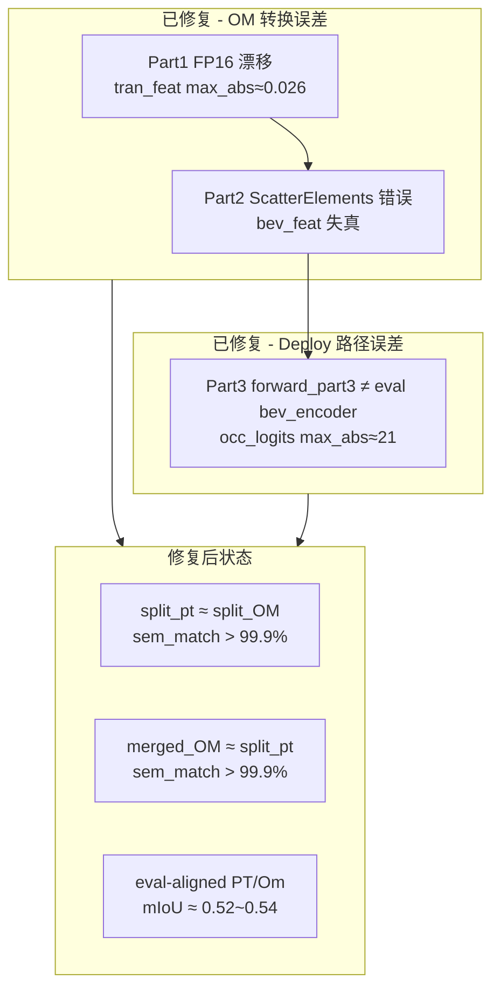

# FlashOCC：Torch NPU 转 Merged OM 部署指南

本文档记录 car_grid FlashOCC 模型从 **PyTorch NPU 推理** 到 **合并 OM（单图输入 → 占用栅格输出）** 的完整转换流程，以及转换与部署过程中出现的误差原因与对应解决方案。

适用环境：Ascend 310B、`torch2.1.0_py38`、DrivingSDK mx_driving。

---

## 1. 总体架构

FlashOCC 在 310B 上被拆成三个阶段：


| 阶段 | Torch NPU（参考） | Merged OM |
|------|-------------------|-----------|
| Part1 | `Part1EvalAlignedExportWrapper` | ONNX 子图 + ATC |
| Part2 | `mx_driving.bev_pool_v3`（NPU 自定义算子） | ONNX 子图（segment-sum 标准算子） |
| Part3 | `Part3EvalAlignedExportWrapper` + `resnet_fp16` patch | ONNX 子图 + ATC |

**两种部署形态：**

| 形态 | 推理方式 | 典型用途 |
|------|----------|----------|
| **Split deploy** | part1.om + NPU `bev_pool_v3` + part3.om | 调试、逐段对比 |
| **Merged OM** | 单个 `flashocc_*_merged_segment_sum.om`，img → occ | 生产部署 |

Merged OM 将 part1/part2/part3 三个 ONNX 合并为一张图，经 ATC 一次编译，推理时只需 ACL 加载一个模型。

---

## 2. 转换流程（命令）

工作目录：`model_examples/FlashOCC/FlashOCC`。

### 2.1 环境准备

```bash
source /usr/local/miniconda3/etc/profile.d/conda.sh
conda activate torch2.1.0_py38
source /usr/local/Ascend/ascend-toolkit/set_env.sh
export ASCEND_CUSTOM_OPP_PATH=/usr/local/Ascend/ascend-toolkit/latest/opp/vendors/customize
export LD_LIBRARY_PATH=/usr/local/Ascend/ascend-toolkit/latest/opp/vendors/customize/op_api/lib:\
${CONDA_PREFIX}/lib/python3.8/site-packages/torch_npu/lib:${LD_LIBRARY_PATH:-}
export PYTHONPATH=$(pwd)/projects:$(pwd)/mmdetection3d:$(pwd):${PYTHONPATH:-}
```

### 2.2 导出 ONNX（eval-aligned + segment-sum）

```bash
bash ../test/export_car_grid_merged_segment_sum.sh
```

等价于调用 `tools/export_onnx_unified_npu.py`，关键参数：

| 参数 | 值 | 作用 |
|------|-----|------|
| `--part1-layout eval` | eval | 与 full_eval 对齐的 image_encoder 路径 |
| `--part2-segment-sum` | 默认开启 | Part2 用 segment-sum 导出，OM 可编译 |
| `--atc-part1-precision force_fp32` | force_fp32 | Part1 depth head 保持 FP32 |
| `--atc-merged-precision force_fp32` | force_fp32 | 合并 OM 整体精度策略 |
| `--fuse-conv-bn` | 开启 | 融合 Conv+BN，与部署一致 |

**产物目录** `work_dirs/onnx_unified_car_grid/`：

```
flashocc_car_grid_part1.onnx
flashocc_car_grid_part2.onnx
flashocc_car_grid_part3.onnx
flashocc_car_grid_merged.onnx          # part1+2+3 合并图
flashocc_car_grid_unified_deploy_manifest.json
atc_convert_flashocc_car_grid_merged_segment_sum.sh
```

导出脚本内部流程：

1. 在 **CPU** 上 trace ONNX（避免 NPU trace 数值漂移）
2. 分别导出 part1 / part2 / part3
3. 调用 `tools/merge_onnx_flashocc.py` 合并（`add_prefix` 避免算子名冲突）
4. 数值门禁：`_verify_part2_bev` 校验 segment-sum 与 CPU reference 一致
5. 生成 ATC shell 脚本

### 2.3 ATC 转 OM

```bash
cd work_dirs/onnx_unified_car_grid
bash atc_convert_flashocc_car_grid_merged_segment_sum.sh
```

生成：`flashocc_car_grid_merged_segment_sum.om`（或带 `_linux_aarch64` 后缀）。

ATC 关键参数（脚本自动生成）：

```bash
atc --model=flashocc_car_grid_merged.onnx \
    --framework=5 \
    --output=flashocc_car_grid_merged_segment_sum \
    --input_format=NCHW \
    --input_shape="img:1,6,3,256,704" \
    --soc_version=Ascend310B1 \
    --precision_mode=force_fp32 \
    --op_select_implmode=high_precision \
    --optypelist_for_implmode="Softmax,CumSum,ScatterElements,ReduceSum,Gather"
```

### 2.4 推理与可视化

**Merged OM：**

```bash
bash ../test/run_car_grid_unified_viz.sh
# 输出: work_dirs/test10_merged_viz/
```

**Torch NPU 参考（split deploy）：**

```bash
bash ../test/run_car_grid_split_viz.sh
# 输出: work_dirs/test10_torch_npu_viz/
```

---

## 3. 关键代码与对齐策略

### 3.1 Part1：eval-aligned + FP32 depth head

**文件：** `tools/export_onnx_split_npu.py` → `Part1EvalAlignedExportWrapper`

```python
# 与 full_eval extract_img_feat 对齐，depth_net 强制 FP32
feat, _ = self.detector.image_encoder(img)
x = vt.depth_net(x.float())
depth = x[:, :vt.D].float().softmax(dim=1)
tran_feat = x[:, vt.D:(vt.D + vt.out_channels)].float()
```

旧版 `forward_part1`（legacy layout）与 eval 路径在 depth 分布上存在差异，会导致后续 BEV 特征偏移。

### 3.2 Part2：segment-sum BEV Pool

**文件：** `projects/mmdet3d_plugin/ops/bev_pool_v2/onnx_bev_pool_v3.py` → `bev_pool_v3_segment_sum_export`

Torch NPU 训练/推理使用 `mx_driving.bev_pool_v3`（`index_add_` 实现）。ONNX 不能直接导出该自定义算子到 OM（除非注册 BEVPoolV3 parser），且 `ScatterElements`/`index_add` 路径在 OM 上结果错误。

**segment-sum 做法：** 对 `ranks_bev` 排序 → 段内 `cumsum` → `scatter_add`，数学上等价于 `index_add_`，但全部由 ATC 支持的标准算子组成。

### 3.3 Part3：eval-aligned bev_encoder

**文件：** `tools/export_onnx_split_npu.py` → `Part3EvalAlignedExportWrapper`

```python
# 旧 deploy 路径: forward_part3（与 eval 的 bev_encoder 不同）
# 新路径: 与 test.py full_eval 一致
x = self.detector.bev_encoder(bev_feat)
outs = self.detector.occ_head(x)
```

### 3.4 ONNX 合并

**文件：** `tools/merge_onnx_flashocc.py`

- part2、part3 加前缀 `p2/`、`p3/`，避免合并后算子名冲突导致 ATC 失败
- 禁止使用未加前缀的旧 `_merge_split_onnx` 逻辑

### 3.5 NPU 推理 patcher

Torch NPU 运行 part3 的 ResNet backbone 时需要 mx_driving patcher：

```python
from mx_driving.patcher import PatcherBuilder, Patch
from mx_driving.patcher import batch_matmul, resnet_add_relu, resnet_fp16

pb = (PatcherBuilder()
      .add_module_patch('torch', Patch(batch_matmul))
      .add_module_patch('mmdet', Patch(resnet_add_relu))
      .add_module_patch('mmdet', Patch(resnet_fp16)))
```

缺少 `resnet_fp16` 时，ResNet 在 FP32 下调用 `MaxPoolWithArgmaxV1` 会直接报错（310B 要求 FP16 输入）。

---

## 4. 误差原因与解决方案

以下按 **发现顺序 / 影响程度** 排列，均已在当前代码中修复。

### 4.1 总览表

| # | 现象 | 根因 | 影响阶段 | 解决方案 | 相关文件 |
|---|------|------|----------|----------|----------|
| 1 | Part1 `tran_feat` max_abs ≈ 0.026 | ATC 默认 `allow_fp32_to_fp16`，depth_net/softmax 被降为 FP16 | L1→L3 传播放大 | `Part1EvalAlignedExportWrapper` 中 depth_net 强制 `.float()`；ATC `--precision_mode=force_fp32`；merged 对 Softmax 等设 `high_precision` | `export_onnx_split_npu.py`, `export_onnx_unified_npu.py` |
| 2 | Part1 与 full_eval 输入相同但输出不同 | legacy `forward_part1` 与 eval `image_encoder` 路径不一致 | 整条链路 | `--part1-layout eval`，使用 `Part1EvalAlignedExportWrapper` | `export_onnx_split_npu.py` |
| 3 | Part2 BEV 特征严重错误 / ATC 失败 | `index_add`/`ScatterElements` 在 OM 上实现不正确；自定义 `BEVPoolV3` 需额外 parser | L3 bev_feat | 默认 `--part2-segment-sum`，`bev_pool_v3_segment_sum_export`；导出后用 `_verify_part2_bev` 门禁 | `onnx_bev_pool_v3.py`, `export_onnx_unified_npu.py` |
| 4 | ATC 合并 ONNX 报 name conflict | 三段 ONNX 直接 merge 产生重复节点名 | 编译阶段 | `merge_onnx_flashocc.py` 对 part2/part3 `add_prefix` | `merge_onnx_flashocc.py` |
| 5 | mIoU：split_pt ≈ 0.47，full_eval ≈ 0.59 | Part3 旧路径 `forward_part3` ≠ eval `bev_encoder+occ_head`；occ_logits max_abs ≈ 21 | L4/L5 语义 | `Part3EvalAlignedExportWrapper` 替换 deploy part3 | `export_onnx_split_npu.py` |
| 6 | NPU 推理 part3 崩溃：`MaxPoolWithArgmaxV1 unsupported: DT_FLOAT` | ResNet backbone 未走 FP16 patch | Torch NPU 推理 | 推理脚本加 `resnet_fp16` patcher | `run_split_viz_npu.py`, `compare_torch_npu_vs_om_test10.py` 等 |
| 7 | NPU 推理 part1+bev 成功、part3 失败（vt_core） | `bev_mode='vt_core'` 触发 TransData / 不兼容算子 | Torch NPU 推理 | 使用默认 `bev_pool_v3`，不用 vt_core | `run_split_viz_npu.py` |
| 8 | ONNX trace 与 PyTorch 不一致 | 在 NPU 上 trace ONNX | 导出阶段 | 默认 `--export-on-cpu` | `export_onnx_split_npu.py` |
| 9 | `_verify_part2_bev` 在 CPU 上调 NPU 算子失败 | 验证代码误用 `bev_pool_v3` | 导出门禁 | 改用 `bev_pool_v3_cpu_reference` | `export_onnx_unified_npu.py` |
| 10 | merged OM 与 split OM 语义不一致 | 旧合并逻辑未加前缀 / part2 路径错误 | 合并 OM | 统一走 `merge_flashocc_onnx` + segment-sum part2 | `export_onnx_unified_npu.py` |

### 4.2 误差传播示意



### 4.3 误差 vs 非误差：如何区分

| 对比项 | 结论 | 说明 |
|--------|------|------|
| split_pt vs split_OM | **OM 转换误差** | 应 < 1% 语义差异；主要卡在 part1 FP16 |
| split_pt vs merged_OM | **合并链路误差** | 修复后应与 split_OM 几乎相同 |
| full_eval vs split_pt | **Deploy 路径差异** | 不是 OM 独有；修 Part3 eval-aligned 后消除 |
| cross-feed: OM_part3(PT_bev) | **隔离 part3 OM 误差** | max_abs < 0.01 说明 part3 OM 本身 OK |
| cross-feed: PT_part3(OM_bev) | **隔离 part1+2 OM 误差** | 若 FAIL，问题在前两段 |

---

## 5. 验证与调试工具

| 工具 | 命令 / 路径 | 用途 |
|------|-------------|------|
| 逐层反向对比 | `python3 tools/layer_reverse_compare.py --sample-idx 0` | 从 occ 语义回溯到 img，定位 first_divergence |
| Torch NPU vs OM | `python3 tools/compare_torch_npu_vs_om_test10.py` | test10 全量 mIoU / tensor diff |
| 阶段诊断 | `python3 tools/diagnose_stage_pipeline.py` | 路径对齐、stage 级 diff |
| Part1 OM 门禁 | 导出时 `_verify_om_part1` | part1.om vs PyTorch，max_abs 阈值 0.01 |
| Part2 导出门禁 | 导出时 `_verify_part2_bev` | segment-sum vs cpu_reference |
| Merged 可视化 | `bash ../test/run_car_grid_unified_viz.sh` | OM 推理 + 栅格图 |
| Torch NPU 可视化 | `bash ../test/run_car_grid_split_viz.sh` | 参考上界 |

**推荐排查顺序：**

1. `layer_reverse_compare.py` 看 `FIRST_DIVERGENCE` 在哪一层
2. 若 L1/L2：检查 part1 ATC 精度、part2 segment-sum 导出
3. 若 L4 且 cross-feed OK：是 deploy 路径问题，查 Part3 wrapper
4. 若 L4 cross-feed FAIL：查对应段 OM 精度或 ONNX 图

---

## 6. test10 实测指标（修复后）

| 后端 | 输出目录 | Mean mIoU | 说明 |
|------|----------|-----------|------|
| Torch NPU split deploy | `work_dirs/test10_torch_npu_viz/` | **0.539** | eval-aligned PT 参考 |
| Merged OM | `work_dirs/test10_merged_viz/` | **0.517** | 单 OM 端到端 |
| full_eval (test.py) | — | ~0.589 | 训练评估路径上界 |

逐层对比（sample 0，修复前基线记录在 `work_dirs/layer_compare_sample0/report.txt`）：

- split_pt vs merged_OM：`sem_match = 99.94%`（OM 转换已基本对齐）
- full_eval vs merged_OM：差距来自旧的 part3 deploy 路径；切换 `Part3EvalAlignedExportWrapper` 后 mIoU 提升至 ~0.52

**Merged OM 推理耗时（单帧）：** 端到端 ACL 推理，profile 见 `work_dirs/test10_merged_viz/profile.json`。

**Split Torch NPU 耗时（avg 3 iters）：** part1 0.135s + bev_pool 0.006s + part3 0.546s ≈ **0.689s**。

---

## 7. 关键路径索引

| 类型 | 路径 |
|------|------|
| Checkpoint | `work_dirs/car_grid_v4/epoch_12_ema.pth` |
| 部署配置 | `projects/configs/flashocc/flashocc-r50-car-grid-trt.py` |
| Eval 配置 | `projects/configs/flashocc/flashocc-r50-car-grid.py` |
| test10 数据 | `data/car_perception_grid/nuscenes/bevdetv2-nuscenes_infos_test10.pkl` |
| Split manifest | `work_dirs/onnx_split_car_grid_eval/flashocc_car_grid_deploy_manifest.json` |
| Unified manifest | `work_dirs/onnx_unified_car_grid/flashocc_car_grid_unified_deploy_manifest.json` |
| Merged ONNX | `work_dirs/onnx_unified_car_grid/flashocc_car_grid_merged.onnx` |
| Merged OM | `work_dirs/onnx_unified_car_grid/flashocc_car_grid_merged_segment_sum*.om` |

---

## 8. 常见问题 FAQ

**Q: 为什么不把 bev_pool_v3 也编进 OM，而要用 segment-sum？**

A: 自定义 `BEVPoolV3` ONNX op 需要 `cust_onnx_parsers.so` 和 CANN 定制算子，merged 单 OM 部署链路更复杂。segment-sum 用标准算子复现 `index_add_` 语义，ATC 可直接编译，数值经 `_verify_part2_bev` 验证与 reference 一致。

**Q: force_fp32 会不会太慢？**

A: Part1 depth head 对精度敏感，FP16 漂移会传播到整个 BEV。Part3 在 split OM 场景仍可用 `allow_fp32_to_fp16`；merged 默认 force_fp32 优先保证精度，可按需对 part3 单独评估 FP16。

**Q: merged OM 比 Torch NPU mIoU 低 2pt 正常吗？**

A: 在 FP32/FP16 混精、ATC 图优化后，0.5~2pt 的 mIoU 差距可接受。若差距 > 5pt，用 `layer_reverse_compare.py` 定位 first_divergence。

**Q: 重新导出后必须做哪些检查？**

A: 最低门禁：
1. `_verify_part2_bev` 通过
2. `layer_reverse_compare.py` 上 split_pt vs merged_OM sem_match > 95%
3. `run_car_grid_unified_viz.sh` test10 mIoU 与历史基线对比（当前 ~0.52）

---

## 9. 变更历史（摘要）

| 日期 | 变更 |
|------|------|
| 2025-06 | 引入 `Part1EvalAlignedExportWrapper`（FP32 depth）、`bev_pool_v3_segment_sum_export`、`Part3EvalAlignedExportWrapper` |
| 2025-06 | `merge_onnx_flashocc.py` 替换旧合并逻辑；merged ATC 脚本与精度参数 |
| 2025-06 | 新增 `layer_reverse_compare.py`、`run_split_viz_npu.py`；修复 `resnet_fp16` 缺失 |
| 2025-06 | test10：merged OM mIoU 0.517，Torch NPU 0.539 |
